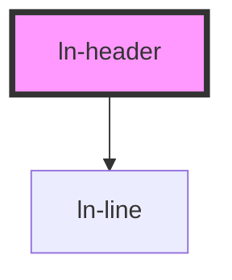

# ln-header

<!-- Auto Generated Below -->

## Properties

| Property  | Attribute | Description | Type                       | Default     |
| --------- | --------- | ----------- | -------------------------- | ----------- |
| `level`   | `level`   |             | `2 \| 3`                   | `undefined` |
| `variant` | `variant` |             | `"primary" \| "secondary"` | `'primary'` |

## Dependencies

### Depends on

- [ln-line](../ln-line)

### Graph

----------------------------------------------

*Built with [StencilJS](https://stenciljs.com/)*
