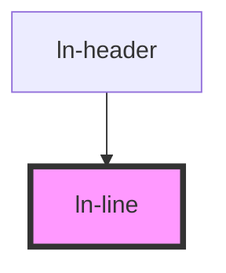

# ln-line

<!-- Auto Generated Below -->

## Properties

| Property  | Attribute | Description | Type                       | Default     |
| --------- | --------- | ----------- | -------------------------- | ----------- |
| `variant` | `variant` |             | `"primary" \| "secondary"` | `'primary'` |

## Dependencies

### Used by

 - [ln-header](../ln-header)

### Graph

----------------------------------------------

*Built with [StencilJS](https://stenciljs.com/)*
